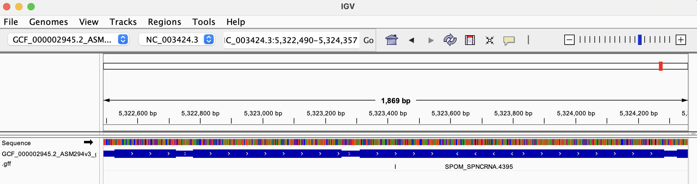
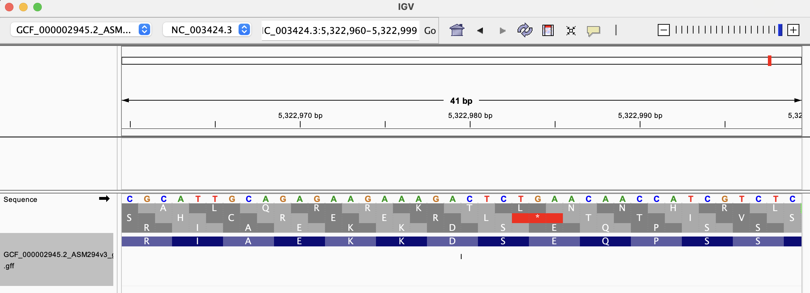
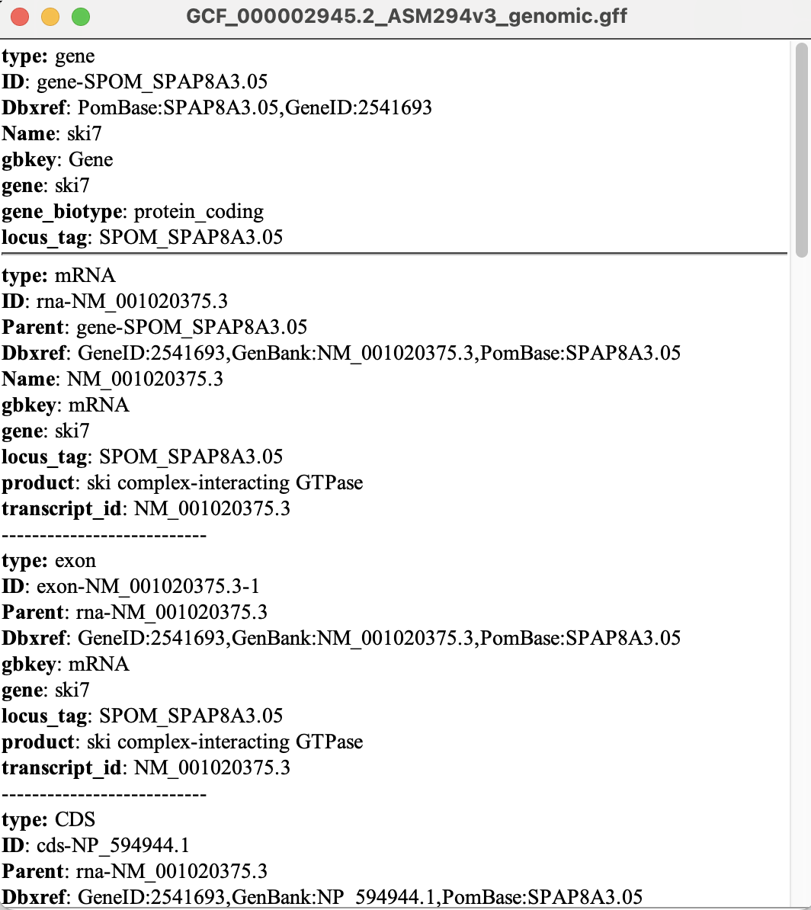
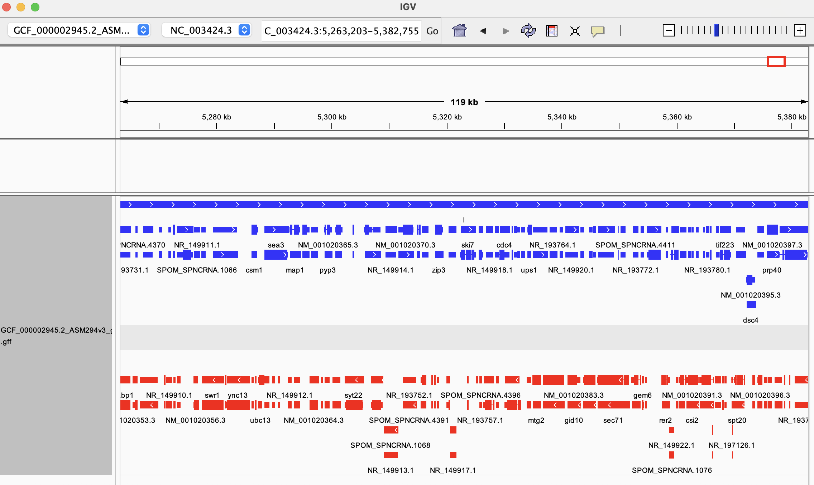

# Week 02

This assignment downloads, examines, and visualizes the reference genome and annotation of *Schizosaccharomyces pombe* strain 972h-.

## 1. Selected genome

- Organism: *Schizosaccharomyces pombe* 972h-
- Assembly: ASM294v3
- NCBI RefSeq accession: GCF_000002945.2
- Assembly level: Chromosome
- Data source: [NCBI Genomes FTP](https://ftp.ncbi.nlm.nih.gov/genomes/all/GCF/000/002/945/GCF_000002945.2_ASM294v3/)

## 2. How to use Makefile

The Makefile downloads the compressed genomic FASTA (`.fna.gz`) and GFF3
annotation (`.gff.gz`) files from NCBI, decompresses them, and stores them in
directories according to file type:

- `data/fasta/GCF_000002945.2_ASM294v3_genomic.fna`
- `data/gff/GCF_000002945.2_ASM294v3_genomic.gff`

Run the following command from this directory:

```bash
make
```

The command requires `curl`, `gzip`, and GNU Make. Make will not download a
file again if its output already exists. 

## 3. Genome Assembly Statistics and Completeness

### 3.1.1 How large is the genome?

Command:

```bash
seqkit stats data/fasta/GCF_000002945.2_ASM294v3_genomic.fna
```

Output:

```text
file                                             format  type  num_seqs     sum_len  min_len      avg_len    max_len
data/fasta/GCF_000002945.2_ASM294v3_genomic.fna  FASTA   DNA          4  12,591,253   19,433  3,147,813.3  5,579,133
```

The genome assembly is 12,591,253 bp (approximately 12.59 Mb) long.

### 3.1.2 How many chromosomes does it have?

Command:

```bash
grep -c '^>.*chromosome:' data/fasta/GCF_000002945.2_ASM294v3_genomic.fna
```

Output:

```text
3
```

The genome has three chromosomes.

### 3.2 How many annotations are in the annotation file?

Command:

```bash
grep -vE '^(#|$)' data/gff/GCF_000002945.2_ASM294v3_genomic.gff | wc -l
```

Output:

```text
53910
```

The annotation file contains 53,910 annotation records.

### 3.3 How complete is this genomic build in your opinion?

Command:

```bash
grep '^>' data/fasta/GCF_000002945.2_ASM294v3_genomic.fna
grep -v '^>' data/fasta/GCF_000002945.2_ASM294v3_genomic.fna | tr -cd 'Nn' | wc -c
```

Output:

```text
>NC_003424.3 Schizosaccharomyces pombe strain 972h- genome assembly, chromosome: I
>NC_003423.3 Schizosaccharomyces pombe strain 972h- genome assembly, chromosome: II
>NC_003421.2 Schizosaccharomyces pombe strain 972h- genome assembly, chromosome: III
>NC_088682.1 Schizosaccharomyces pombe isolate MT1 mitochondrion, complete genome
402
```

In my opinion, this genomic build is highly complete because all three nuclear chromosomes and the complete mitochondrial genome are represented, with only 402 unknown bases (`N`) in the 12.59 Mb assembly.

## 4. Visualizing with IGV

### 4.1 How tightly packed are the genes in this genome? Estimate the gene-to-gene distance via the browser.



Genes appear to be tightly packed in this region, although the intergenic distances vary. Based on visual inspection in IGV, the distances between neighboring genes are appearing to be approximately 100bp.

### 4.2 Pick a coordinate on the chromosome and visually inspect the sequence regions around it.



### 4.3 Describe all six reading frames (codons) that the coordinate could be part of.

I selected coordinate **5,322,980** on chromosome **NC_003424.3**. The nucleotide at this position is C. The three possible codons on each strand that contain this coordinate are:

- Forward strand:
  - `GAC` (positions 5,322,978–5,322,980) encodes Aspartic acid (D).
  - `ACT` (positions 5,322,979–5,322,981) encodes Threonine (T).
  - `CTC` (positions 5,322,980–5,322,982) encodes Leucine (L).
- Reverse strand:
  - `GTC` (reverse complement of positions 5,322,978–5,322,980) encodes Valine (V).
  - `AGT` (reverse complement of positions 5,322,979–5,322,981) encodes Serine (S).
  - `GAG` (reverse complement of positions 5,322,980–5,322,982) encodes Glutamic acid (E).

Therefore, depending on the strand and reading frame, this coordinate could be part of a codon encoding D, T, L, V, S, or E.

### 4.4 Identify the type of feature displayed as a data track.



The selected feature is the protein-coding gene **ski7** (locus tag `SPOM_SPAP8A3.05`). The GFF data track shows its hierarchical annotations, including the gene, its mRNA transcript (`NM_001020375.3`), exon, and coding sequence (CDS). Its annotated product is the ski complex-interacting GTPase.

### 4.5 Color features by their strand orientation.



The features were colored by strand orientation in IGV. 
Blue features are located on the forward (`+`) strand and point from left to right, whereas red features are located on the reverse (`-`) strand and point from right to left.
