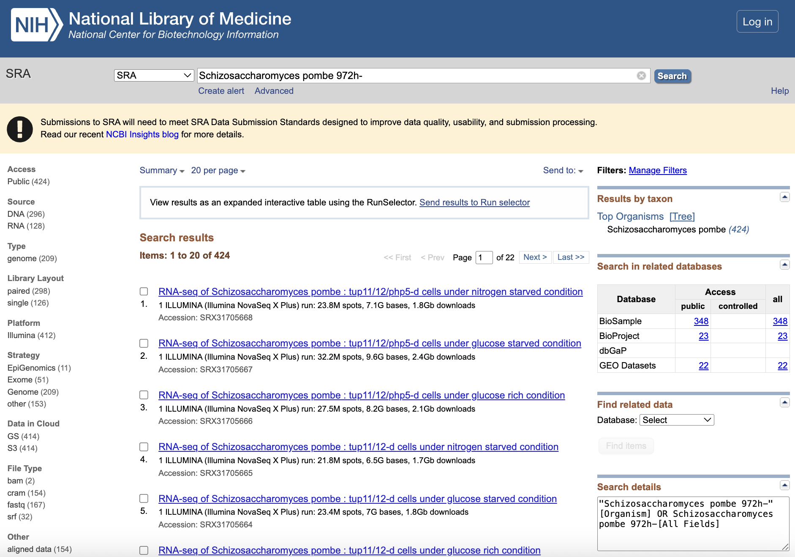
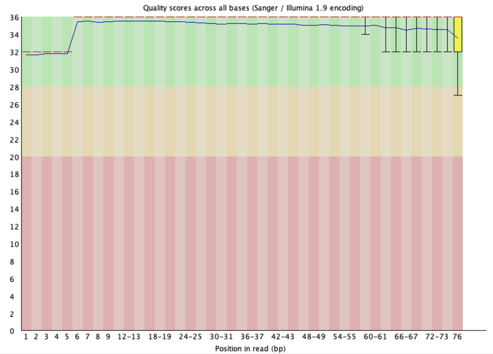
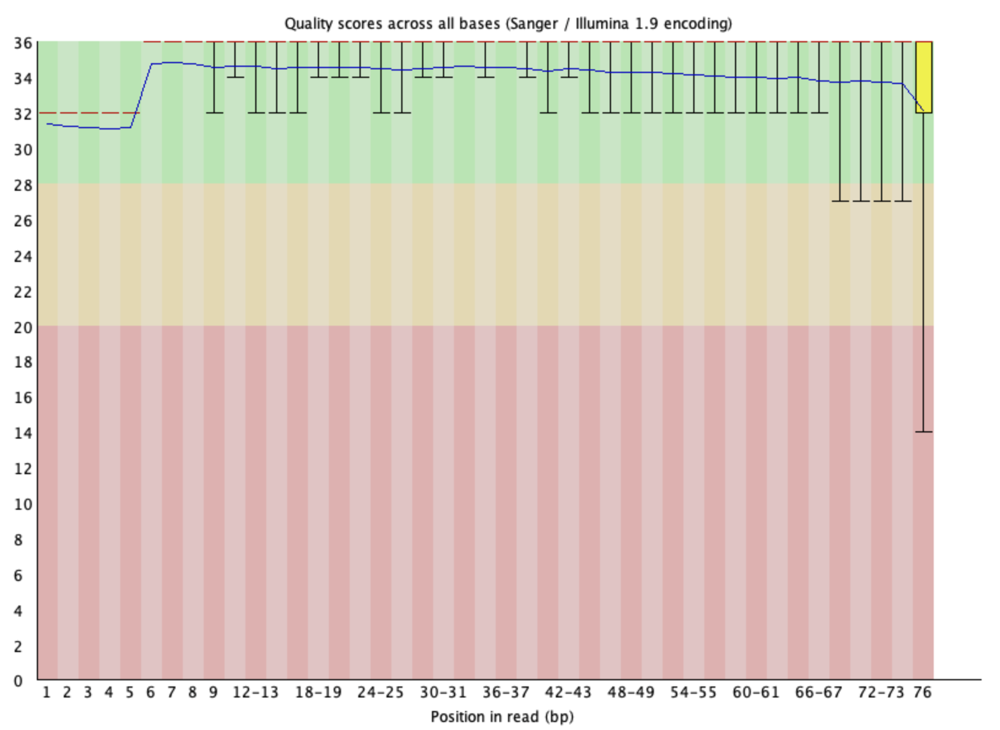
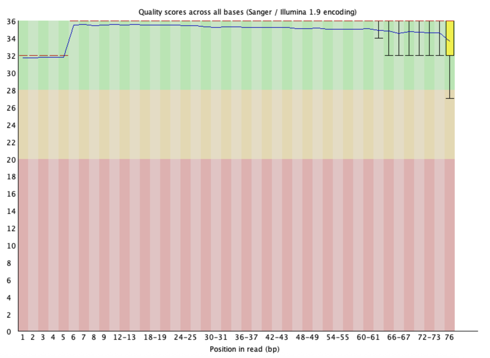
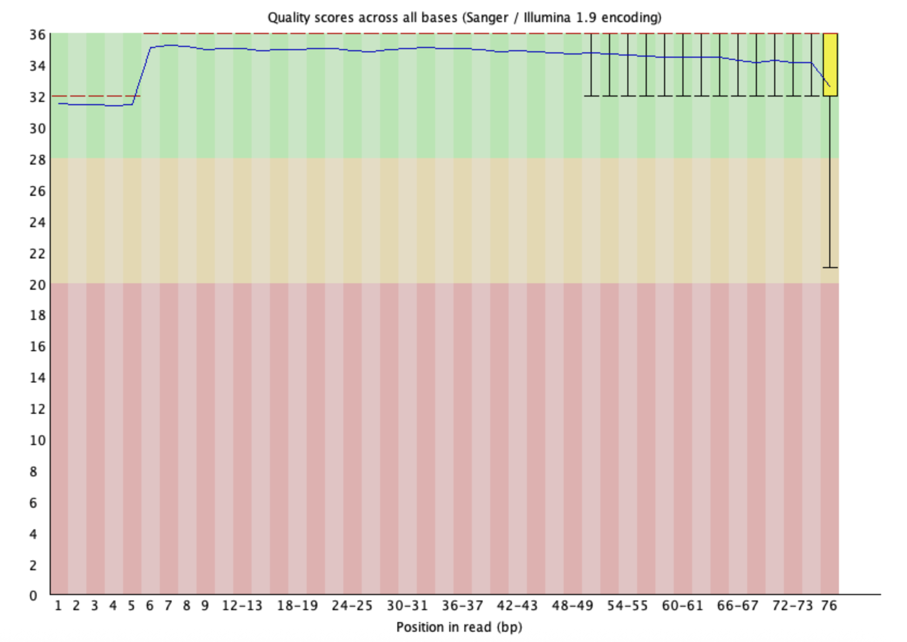

# Week 04: Get FASTQ from SRA

This assignment surveys public sequencing data for *Schizosaccharomyces
pombe* and downloads a small subset of one RNA-seq run. The workflow performs
quality control before and after read trimming.

## 1. Assess the experimental evidence for the genome

### 1.1. How "popular" is this genome? How many datasets are available?

I searched NCBI SRA for `Schizosaccharomyces pombe 972h-` and found **424
public records**. This indicates that *S. pombe* is a popular model organism
with substantial public sequencing data.



### 1.2. What is the breakdown by sequencing strategy and platform?

- Sequencing strategy: Genome, 209; Exome, 51; Epigenomics, 11; other, 153.
- Platform: Illumina, 412; other platforms, 12.
- Source: DNA, 296; RNA, 128.
- Library layout: paired-end, 298; single-end, 126.

### 1.3. What do you find interesting or surprising?

Illumina accounts for 412 of the 424 records, showing that one platform
dominates the available data. I was also surprised to find 51 records
classified as Exome because *S. pombe* has a small, gene-dense genome. The
large number of RNA and other experiments shows that this organism is used for
more than genome sequencing.

## 2. Download FASTQ files for an experiment

I selected **SRR10192871**, an Illumina NextSeq 500 paired-end RNA-seq run for
*S. pombe*. The sample is `Glyc_spo rep 1` and the complete run contains
6,592,696 spots (about 1.0 billion bases). Only the first `N` spots are
downloaded for this assignment.

### 2.1 How to use Makefile

The workflow requires SRA Toolkit (`fastq-dump`), FastQC, and fastp. From the
`week04` directory, run the complete workflow with:

```bash
make N=10000
```

This downloads the first 10,000 spots, runs FastQC on the raw reads, trims the
reads with fastp, and runs FastQC again on the trimmed reads.

Each step can also be run separately:

```bash
make metadata           # Download metadata for the accession
make download N=10000   # Download the first 10,000 spots
make qc                 # Run FastQC on the raw reads
make trim               # Trim adapters and low-quality bases with fastp
make qc-trimmed         # Run FastQC on the trimmed reads
make help               # Show the available Makefile commands
```

Required earlier steps run automatically. For example, `make qc` downloads
the metadata and reads first when they are not already available.

The default accession is `SRR10192871`. To process another run, provide its
accession and the desired subset size:

```bash
make ACCESSION=SRR_ACCESSION N=10000
```

Raw reads are saved in `data/raw_reads/`, trimmed reads in
`data/trimmed_reads/`, and QC reports in `results/`.

### 2.2 Raw-read quality





The raw reads are generally high quality: the median quality scores remain
above Q30 across all 76 bases. R1 is slightly better than R2. The quality
variation increases near the 3′ end, especially for the last base of R2, where
some reads fall into the low-quality range.

### 2.3 Trimming and quality comparison

I used fastp to remove adapters and low-quality reads or bases, then ran FastQC
again.





Fastp retained 18,346 of 20,000 reads (91.73%). The Q30 rate increased from
94.39% to 95.60%, and 593 reads containing adapter sequence were trimmed.
After trimming, both R1 and R2 still have median scores above Q30, while the
low-quality spread at the 3′ end is reduced, particularly for R2. The visual
improvement is modest because the raw reads were already high quality, but the
trimmed reads contain fewer low-quality tails and adapter sequences.