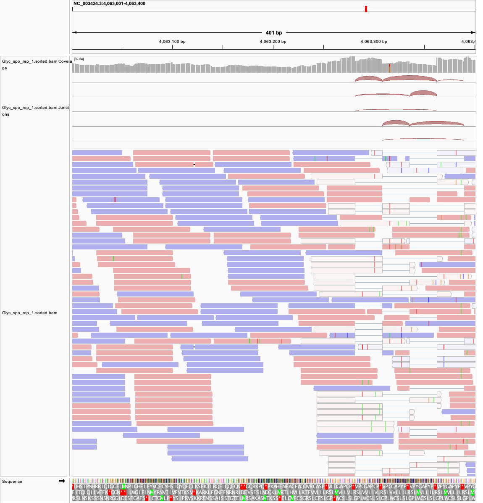

# Week05: Generate a BAM file

I aligned a subset of paired-end RNA-seq reads from *Schizosaccharomyces pombe* run **SRR10192871** to the **GCF_000002945.2 / ASM294v3** genome. HISAT2 handles reads spanning exon junctions. The Makefile creates a coordinate-sorted BAM, its index, and SAMtools reports.

## 1. How to choose N

The *Schizosaccharomyces pombe* ASM294v3 reference is **12,591,253 bp**. Run `SRR10192871` contains 76 bp paired-end RNA-seq reads. For nominal 10× coverage:

`N = ceil(10 × 12,591,253 / (2 × 76)) = 828,372 paired-end spots`.

That is 1,656,744 reads and 125,912,544 sequenced bases. Because these are RNA-seq reads, genomic coverage will be uneven.

## 2. How to use Makefile

Requirements: GNU Make, `curl`, `gzip`, SRA Toolkit (`fastq-dump`), HISAT2, and samtools on `PATH`; internet access for downloads. Run from `week05/`:

```bash
make THREADS=4
```

Or run each stage:

| Command | Result |
| --- | --- |
| `make genome` | Download and decompress the reference FASTA into `data/genome/`. |
| `make fastq N=828372` | Download the first `N` spots from `SRR10192871` into two compressed FASTQ files in `data/fastq/`. |
| `make index` | Build the HISAT2 reference index. |
| `make align` | Align both FASTQ files, sort the BAM, and create its `.bai` index. |
| `make stats` | Write HISAT2, flagstat, idxstats, coverage, and samtools stats reports. |

I use HISAT2 because this is RNA-seq and some reads span splice junctions. 

`make` runs all stages in dependency order. 

You can override `N`, `SRR`, `SAMPLE`, or `THREADS` on the command line if needed; results for each `N` are kept in a separate directory.

Main output: [`results/SRR10192871/N828372/Glyc_spo_rep_1.sorted.bam`](results/SRR10192871/N828372/Glyc_spo_rep_1.sorted.bam) and its `.bai`. 

Reports: [`flagstat.txt`](results/SRR10192871/N828372/flagstat.txt), [`hisat2_summary.txt`](results/SRR10192871/N828372/hisat2_summary.txt), [`coverage.txt`](results/SRR10192871/N828372/coverage.txt), and [`samtools_stats.txt`](results/SRR10192871/N828372/samtools_stats.txt).

## 3. What percent of the reads align?
 **97.72%** of the 1,656,744 reads have a primary alignment (`1,618,983 / 1,656,744`); **95.69%** are properly paired. HISAT2 reports that **74.91% of pairs** have multiple concordant placements.

## 4. How to visualize the alignment in IGV
To inspect the alignment, open IGV. 
Use **Genomes → Load Genome from File** for `data/genome/GCF_000002945.2_ASM294v3_genomic.fna`.

Then **File → Load from File** for the BAM file. Enter `NC_003424.3:4063001-4063400` in the locus box. 

Right-click the alignment track and select **Color alignments by → read strand**. Red reads are on the positive strand and blue reads are on the negative strand. The BAM index is adjacent to the BAM.



## 5. What do the alignments look like? Do the reads show errors or variations?
In IGV, reads stack over expressed regions and split alignments cross splice junctions. Scattered colored bases mark mismatches. `samtools stats` reports 166,124 mismatches over 122,890,729 mapped bases (about 0.14%), this does not establish whether they are sequencing errors or true variants.

## 6. Is the coverage uniform?
Coverage is **not uniform**. Chromosomes I, II, and III have 48.88%, 46.43%, and 44.15% covered bases, with mean depths of 1.77×, 1.58×, and 40.95×. Mitochondrial breadth and mean depth are 88.39% and 278.29×. Overall, 47.13% of reference bases have at least one primary alignment.