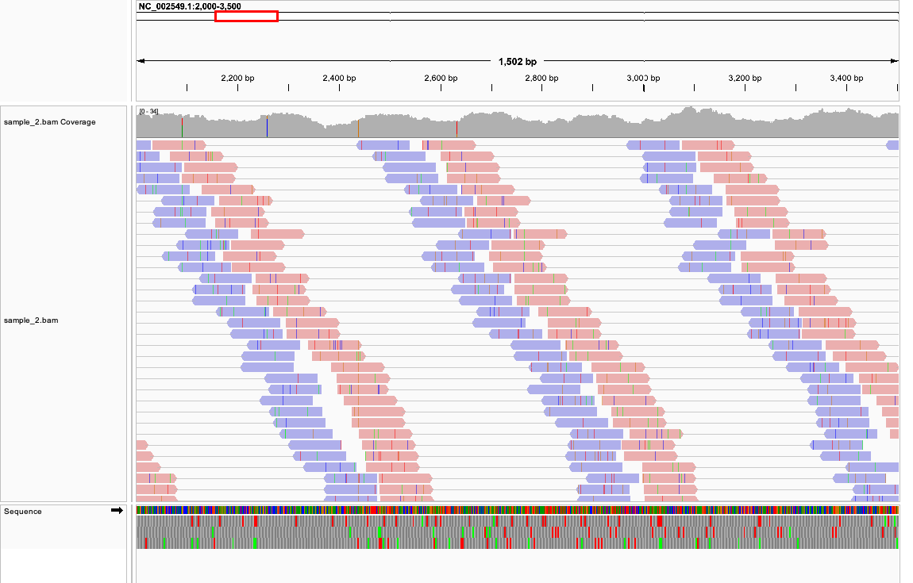
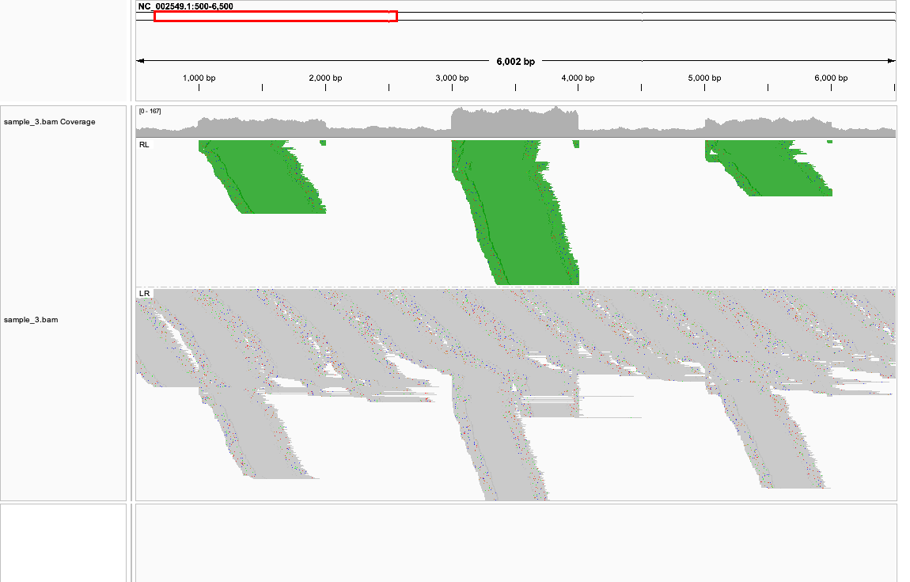
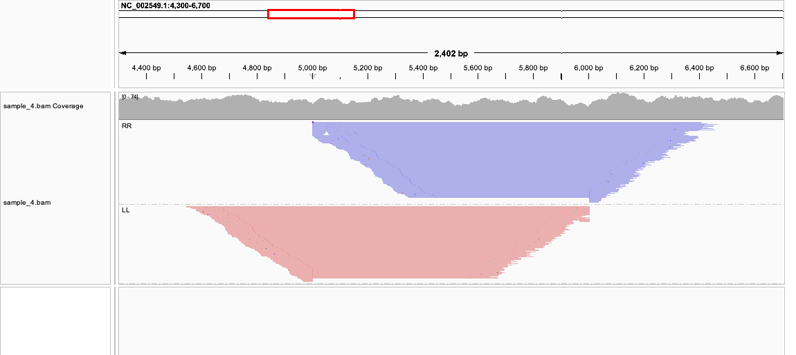
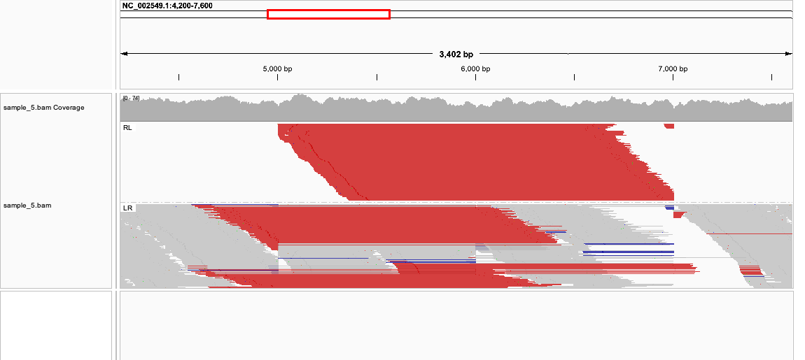

# Week 06: Evaluate structural variants

Align five paired-end sample BAM files to the Ebola reference `ebola-1976.fa`.

## Sample 1: No clear structural variant

I do not see a structural variant in sample 1. All 2,000 pairs are normally oriented FR pairs, which IGV labels LR. Their insert sizes stay on the ~500 bp peak, and coverage is fairly even across the genome. Soft clips and split reads do not cluster anywhere.

I went to `NC_002549.1:2,000–3,500`, turned on View as pairs, and colored the reads by strand. Each pair is blue on the left and red on the right. The two reads face each other, and the lines between them are about the same length. The few colored bases are single mismatches.

## Sample 2: No clear structural variant

Sample 2 looks structurally the same to me. All 2,000 pairs are FR, the insert size is still about 500 bp, and coverage is flat. I do not see pairs with an unusual orientation or an unusual insert size.

The difference from sample 1 is the mismatches. Sample 2 has about three mismatches per read, so the colored ticks on the reads are denser in IGV. Those mismatches are scattered along the genome. They do not pile up at one breakpoint, so I treat them as base-level noise.

I used the same view as sample 1: `NC_002549.1:2,000–3,500`, View as pairs, colored by strand.

## Sample 3: Copy number variation

I went to `NC_002549.1:500–6,500`, turned on View as pairs, and colored and grouped the reads by pair orientation.

I think sample 3 is a copy number variation, seen as three tandem duplications. The extra copies are what raise the read depth. The background depth is about 44×. Coverage rises over 1,000–2,000 to a median of about 91×, roughly twice the background, so that interval looks like one extra copy. Coverage over 3,000–4,000 rises to about 139×, roughly three times the background, so I read that interval as three copies. Coverage over 5,000–6,000 is about 90×, again about twice the background, so that is another extra copy.

Each of these intervals has a band of green RL pairs. In an RL pair the left read is on the reverse strand and the right read is on the forward strand, so the two reads point outward. That is what I expect when a fragment crosses from the end of one copy into the start of the next copy and both ends map back to the same reference interval. Split reads join the two edges of each interval on the same strand. The band at 3,000–4,000 is taller and has more RL pairs than the other two, which matches the higher coverage. Outside these three intervals the pairs are grey LR pairs with a normal insert size.

## Sample 4: Inversion

I went to `NC_002549.1:4,300–6,700`, turned on View as pairs, colored the reads by strand, and grouped them by pair orientation.

I think `NC_002549.1:5001–6000` is inverted. Coverage across 5–6 kb stays level with the sequence around it, so the copy number has not changed. The abnormal pairs fall into two groups, and both reads in a group have the same color. The LL pairs are both on the forward strand, shown in red, and they lie mostly from the left of 5,000 to about 6,000. The RR pairs are both on the reverse strand, shown in blue, and they lie mostly from 5,000 to the right of 6,000. Pairs that point the same way are the pattern I expect for an inversion. Split reads connect about 5,000 to about 6,000, and the two parts of each split read are on opposite strands, so I place the breakpoints at those two positions.

## Sample 5: Translocation

I think this is a translocation. The two adjacent 1 kb blocks have swapped places, and neither block is reversed. On the reference, `5001–6000` comes before `6001–7000`. In this sample the order is `6001–7000` and then `5001–6000`, which is the same event as moving `5001–6000` to just after 7,000. Coverage from 5–7 kb matches the flanking depth, so the copy number is unchanged.

I went to `NC_002549.1:4,200–7,600`, turned on View as pairs, colored the reads by insert size, and grouped them by pair orientation. The abnormal pairs are red, and their insert size is about 1,500 bp, roughly 1 kb longer than the normal 500 bp library. In the LR group I see two clusters of these long pairs. One links upstream of 5,000 to about 6,000. The other links about 6,000 to downstream of 7,000. Those are the new junctions on either side of the moved blocks. The RL group links about 5,000–5,500 to 6,500–7,000. That is the new junction where the end of `6001–7000` meets the start of `5001–6000`. Split reads at all three junctions stay on the same strand: about 5,000 joined to 6,000, about 7,000 joined to 5,000, and about 6,000 joined to 7,000. The strand stays the same, which fits a translocation that keeps the original orientation.

